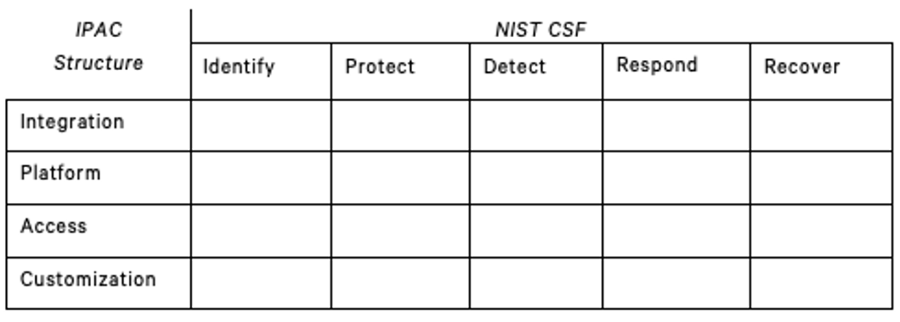

# NO MONKEY Security Matrix

The NO MONKEY Security Matrix, combines elements of the security operational functions, defined by NIST, and IPAC model, created by NO MONKEY and explained below, into a functional graph. The Security Matrix serves as a starting point to:

- Visually show what areas within an organization can be improved
- Identify responsibility and knowledge gaps that are aligned to the areas of the Security Matrix

## IPAC model

NO MONKEY have come up with these four different security areas to focus the security topics to a core business application. The areas are:

> - **Integration:** focus of different integration scenarios within systems themselves, as well as third-party tools integrating with a core business application environment, including proprietary as well as non-proprietary communication protocols and interfaces. Topics include secure architecture, security design, and general security operation concepts.
>
> - **Platform:** consideration of the vulnerabilities, hardening, and configuration of the core business applications. Includes the review of security features and weaknesses in the software's operations, setup, and security management.
> - **Access:** consideration of access control and user authorizations measures and methodologies of core business applications.
> - **Customization:** consideration of the customization of core business applications - including change management, custom code, business customizing, legacy interfaces, and add-ons.

## WIIFM (Whats In It For Me)

The NO MONKEY Security matrix is designed to support teams in several ways: aligning security defenses across the entire matrix.

## Applicability

The NO MONKEY Security Matrix can be used with several approaches when dealing with SAP security. Below is a list of projects that benefit from the NO MONKEY Security Matrix*.

- CBAS - Security Aptitude Assessment
- SAP Internet Research

## License

 This work is licensed under a <a rel="license" href="http://creativecommons.org/licenses/by-sa/4.0/">Creative Commons Attribution-ShareAlike 4.0 International License</a>.
